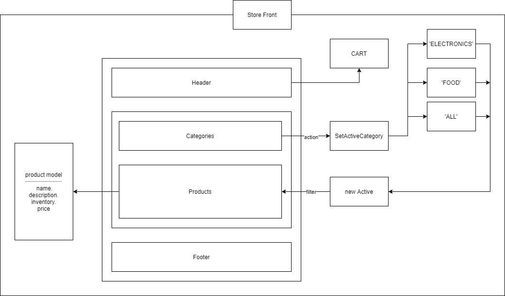
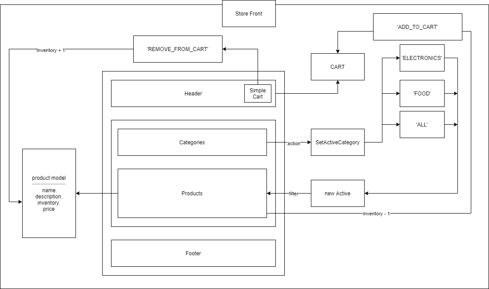
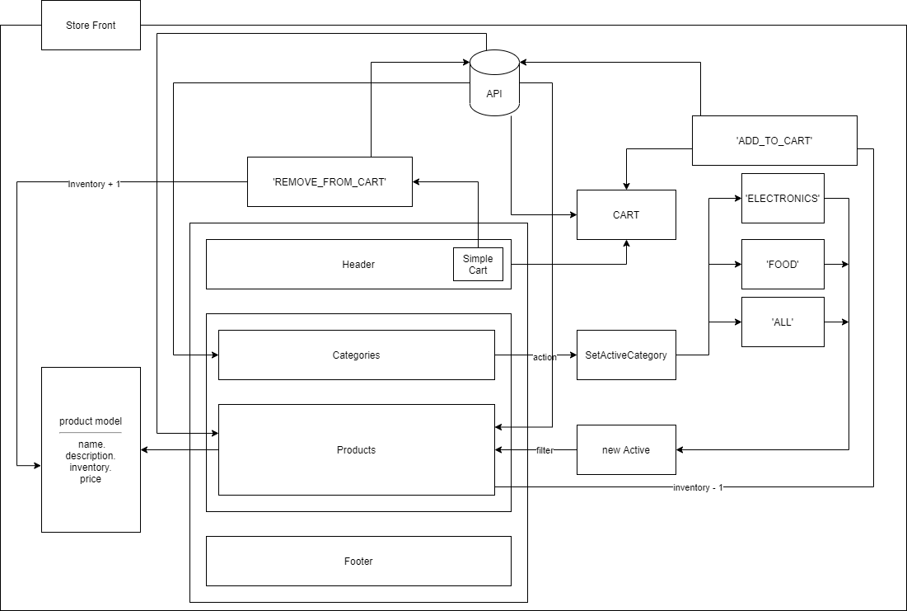

# storefront

### Author: Tamara Al-billeh
* [submission PR](https://github.com/tamaraalbilleh/storefront/pulls) .

### Running the app
- `npm start`

### Deployment
* [deployment for main branch ](https://tama-store.netlify.app/) .

## Redux(phase 1)
### Deployment of the branch :
* [deployment for Redux branch ](https://tama-redux.netlify.app/) .

### UML
(Created with [diagrams](https://app.diagrams.net/))

[for more clear view](https://app.diagrams.net/?src=about#G1s4Fi3ypjyisCxekaStld4Gs9Awv1Tzsn) 

## Combined Reducers(phase 2)
### Deployment of the branch :
* [deployment for Combined Reducers branch ](https://tama-combined-reducers.netlify.app/) .

### UML
(Created with [diagrams](https://app.diagrams.net/))

[for more clear view](https://app.diagrams.net/?src=about#G1s4Fi3ypjyisCxekaStld4Gs9Awv1Tzsn) 

## Thunk (phase 3)
### Deployment of the branch :
* [deployment for Thunk branch ](https://tama-thunk.netlify.app) .

### UML
(Created with [diagrams](https://app.diagrams.net/))

[for more clear view](https://app.diagrams.net/?src=about#G1s4Fi3ypjyisCxekaStld4Gs9Awv1Tzsn) 

